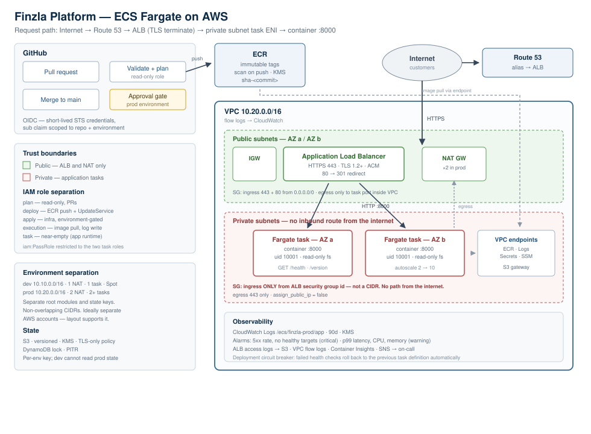

# Finzla Cloud & Platform Engineer — Technical Assessment

AWS deployment platform for a small backend service: containerised app, ECS Fargate infrastructure in Terraform, and a GitHub Actions pipeline authenticating to AWS via OIDC with no long-lived credentials.



> **Setting this up from scratch?** [`SETUP-GUIDE.md`](SETUP-GUIDE.md) walks through it end to end — tool installation, repository creation, AWS bootstrap, deployment, evidence collection, teardown, and troubleshooting.

## Verified versions

Every version below was checked against its upstream registry rather than assumed, on the date of writing. See [section 12](#12-evidence) for the verification output.

| Component | Version | Note |
|---|---|---|
| Terraform | ≥ 1.11 (tested 1.16.1) | 1.11 is the floor for S3-native state locking |
| AWS provider | `~> 6.63` | v6 is a major release; config verified against the v6 upgrade guide |
| Python | 3.13 | FastAPI supports 3.10–3.14; 3.13 chosen as the mature option |
| FastAPI / uvicorn | 0.141.1 / 0.52.4 | |
| pytest / httpx2 / ruff / bandit | 9.1.1 / 2.12.0 / 0.16.6 / 1.9.4 | `httpx2`, not `httpx` — current Starlette deprecates the latter for its test client |
| gitleaks | 8.30.1 (binary) | the *action* requires a paid licence for org-owned repos; the binary does not |

---

## Contents

- [1. What is here](#1-what-is-here)
- [2. The application](#2-the-application)
- [3. Architecture and the request path](#3-architecture-and-the-request-path)
- [4. Terraform layout](#4-terraform-layout)
- [5. Managing without AdministratorAccess](#5-managing-without-administratoraccess)
- [6. CI/CD](#6-cicd)
- [7. Security](#7-security)
- [8. Monitoring and logging](#8-monitoring-and-logging)
- [9. Incident investigation — 503s with healthy tasks](#9-incident-investigation--503s-with-healthy-tasks)
- [10. Engineering judgement](#10-engineering-judgement)
- [11. Running it](#11-running-it)
- [12. Evidence](#12-evidence)
- [13. Known gaps](#13-known-gaps)

---

## 1. What is here

```
.
├── app/                          FastAPI service
│   ├── src/main.py               /health and /version
│   ├── tests/test_api.py         unit tests
│   ├── Dockerfile                multi-stage, non-root, read-only rootfs
│   └── .dockerignore
├── terraform/
│   ├── bootstrap/                state bucket (applied once, by hand)
│   ├── modules/
│   │   ├── network/              VPC, subnets, NAT, flow logs, VPC endpoints
│   │   ├── ecr/                  image repository, immutable tags, scanning
│   │   ├── alb/                  load balancer, TLS, security groups, access logs
│   │   ├── ecs_service/          cluster, task definition, service, IAM, autoscaling
│   │   ├── observability/        alarms, dashboard, SNS topics, log metric filters
│   │   └── github_oidc/          OIDC provider and the plan / deploy / apply roles
│   └── envs/
│       ├── dev/                  10.10.0.0/16 — 1 NAT, 1 task, Spot
│       └── prod/                 10.20.0.0/16 — 2 NAT, 2+ tasks, on-demand
├── .github/workflows/
│   ├── pr-validate.yml           fmt, validate, plan, tests, security scans
│   ├── deploy.yml                build → push → deploy dev → approval → prod
│   └── reusable-deploy.yml       deploy, health check, rollback
└── docs/
    ├── architecture.svg
    └── incident-response.md      runbooks referenced by the alarms
```

Design bias throughout: **smaller and well-understood over clever**. Every non-obvious decision has a comment in the code saying why, because the point of this exercise is the reasoning, not the line count.

---

## 2. The application

Python 3.13 + FastAPI 0.141.1. Two endpoints, as specified.

| Endpoint | Returns |
|---|---|
| `GET /health` | `200 {"status":"ok"}` — or `503` when the readiness flag is off |
| `GET /version` | version, git SHA, build number, environment, uptime |

Requirements from the brief and how each is met:

- **Runs in Docker** — multi-stage build, `python:3.13-slim` base.
- **Uses `APP_ENV`** — read from the environment, injected by the task definition. Also drives whether OpenAPI docs are served (off in prod, since they are free reconnaissance).
- **Logs to stdout/stderr** — JSON lines to stdout via `logging.basicConfig`. No log files inside the container; the `awslogs` driver collects stdout.
- **No secrets in source** — nothing secret is read at import time. Secrets, when the service eventually needs them, arrive as env vars resolved by the ECS agent from Secrets Manager and never appear in the task definition, Terraform state, or the console.

Two details worth calling out:

**The health check touches nothing.** The ALB calls `/health` every 15 seconds per task. If that check queried a database, a brief database blip would fail every task simultaneously and turn a degraded dependency into a total outage. Liveness and dependency health are different questions and want different endpoints.

**`SIMULATE_UNHEALTHY=true`** makes `/health` return 503. That exists to demonstrate the rollback path in section 9 — never set it in production.

Container hardening in the Dockerfile:

- runs as uid 10001, not root
- `readonlyRootFilesystem = true` in the task definition
- build toolchain left behind in stage 1
- `CMD` in exec form, so the app is PID 1 and receives `SIGTERM` directly — without this, ECS task draining waits out the full stop timeout on every deploy
- `initProcessEnabled` to reap zombies

The base image is referenced by tag for readability. **Before production, pin it by digest** — the Dockerfile has the command to get it. A tag is mutable, so an upstream compromise can otherwise reach you silently.

---

## 3. Architecture and the request path

### Choice: ECS Fargate

**Why.** One small stateless HTTP service. Fargate gives container orchestration, rolling deploys, health-check integration and autoscaling with no control plane to run, no nodes to patch, and no Kubernetes version upgrades. Cost scales to near zero in dev.

**What I rejected, and why:**

*EKS* — I would choose it for a fleet of services with service mesh, multi-tenancy, or an existing Kubernetes-fluent team. For one service it adds a $73/month control plane, node lifecycle management, IRSA and CNI configuration, and quarterly forced upgrades. That is real operational cost bought for capability this workload does not use. If Finzla's roadmap has ten services and a platform team, this is the decision to revisit.

*Lambda + API Gateway* — genuinely cheaper at low, spiky traffic and less to operate. I rejected it because the brief specifies a container workload, and because for a fintech backend the cold-start tail latency and the 15-minute execution ceiling constrain future work (long-running reconciliation, persistent connection pools to a database) in ways that are awkward to undo later.

*EC2 + Auto Scaling Group* — most control, most work. Patching, AMI pipelines, and instance draining are all now my problem for no benefit here.

### Request path: Internet → AWS → Application

1. **DNS.** Customer resolves `api.finzla.example`. Route 53 alias record points at the ALB's DNS name.
2. **TLS.** Request arrives at the ALB in a **public** subnet on port 443. The ALB terminates TLS using an ACM certificate. Policy is `ELBSecurityPolicy-TLS13-1-2-2021-06` — TLS 1.2 floor, 1.3 where the client supports it. Port 80 is accepted only to return a `301` to HTTPS; no application traffic is ever served over it.
3. **Routing.** The listener forwards to a target group of type `ip` (required for Fargate `awsvpc` networking). The target group only contains tasks currently passing `GET /health`.
4. **Into the private subnet.** The ALB opens a connection to the task's ENI in a **private** subnet, on port 8000, over the VPC's internal network. This hop never traverses the internet.
5. **Container.** uvicorn serves the request as uid 10001 on a read-only root filesystem. Logs go to stdout, are collected by the `awslogs` driver, and land in `/ecs/finzla-<env>/app`.
6. **Response** returns via the same path. The ALB writes an access log line to S3 with client IP, status code, and target processing time.

### Why the container is not reachable from the internet

Three independent controls, any one of which would be sufficient:

1. **Subnet routing.** Tasks run in private subnets whose route tables have no route from the internet gateway. There is no return path for an unsolicited inbound packet.
2. **No public IP.** `assign_public_ip = false` on the service network configuration.
3. **Security group, by reference not CIDR.** The task security group's only ingress rule is:

   ```hcl
   referenced_security_group_id = aws_security_group.alb.id
   ```

   The source is the ALB's *security group ID*, not an IP range. Only traffic originating from a network interface attached to that security group is accepted — so nothing else in the VPC can reach the container either, not just nothing on the internet. This is the control I would point to first in a review.

The ALB's own egress is also restricted to the task port inside the VPC CIDR, rather than the default allow-all. A load balancer has no business initiating connections anywhere else.

---

## 4. Terraform layout

Six modules composed by two thin environment root modules.

**Why separate root modules per environment rather than workspaces.** Workspaces share one backend, one provider configuration, and one set of credentials. A `terraform apply` run against the wrong workspace can reach production state. Separate directories give each environment its own state key and its own IAM role, and let dev and prod diverge deliberately — one NAT versus two, Spot versus on-demand — without conditionals threaded through every module. The layout also supports separate AWS accounts with no code change, which is where this should end up.

**Deliberate dev/prod differences:**

| | dev | prod |
|---|---|---|
| VPC CIDR | 10.10.0.0/16 | 10.20.0.0/16 (non-overlapping, so they can be peered) |
| NAT gateways | 1 | 2 (survives an AZ loss) |
| Tasks | 1, autoscale 1–3 | 2, autoscale 2–10 |
| Capacity | Fargate Spot | On-demand only |
| Task size | 256 CPU / 512 MB | 512 CPU / 1024 MB |
| Log retention | 14 days | 90 days |
| ALB access logs | 30 days | 365 days |
| ECS Exec | enabled | **disabled** |
| KMS deletion window | 7 days | 30 days |
| ALB deletion protection | off | on |
| 5xx alarm threshold | 20/min | 5/min |

No Spot for the prod baseline: Spot task reclamation during an incident is a failure mode nobody wants to debug under pressure.

ECS Exec is off in prod because an interactive shell into a task holding customer data is an unacceptable *standing* capability. It can be enabled temporarily and audibly if an incident genuinely requires it.

**Sensitive value handling.** No credential appears in any `.tf` file, `.tfvars` file, or workflow. Configuration splits three ways:

- non-sensitive identifiers (region, CIDR, repo name) — variables with defaults
- infrastructure references (state bucket, certificate ARN) — passed by CI from bootstrap outputs
- actual secrets — created out of band in Secrets Manager, referenced by ARN only, resolved by the ECS agent at task start

The `secrets` block in the task definition means the *value* never enters Terraform state. Putting a secret in an `environment` block instead would write it to state in plaintext, which is the most common way secrets leak in Terraform-managed ECS.

---

## 5. Managing without AdministratorAccess

### Remote Terraform state

S3 bucket, created by `terraform/bootstrap` with local state — the bucket holding state cannot store its own state. That stack creates the bucket and its KMS key, then is left alone.

- **versioning on** — the mechanism that makes state recoverable after a bad apply or a corrupted write
- **KMS CMK, not SSE-S3** — gives a CloudTrail audit trail on key use, and lets access be revoked independently of the bucket policy
- **bucket policy denying `aws:SecureTransport = false`** — no state over plaintext HTTP, ever
- **public access block** on all four settings
- **`prevent_destroy`** on the bucket and its KMS key
- **90-day noncurrent version expiration** so history is useful without growing unbounded
- **state key per environment** (`dev/terraform.tfstate`, `prod/terraform.tfstate`), and the per-environment IAM role is scoped to `s3://bucket/<env>/*` — so the dev role cannot read or corrupt production state

### State locking and concurrent changes

**S3-native locking** via `use_lockfile = true` in the backend block. Terraform writes a `<key>.tflock` object using an S3 conditional put before any state write; a second concurrent apply fails to acquire it and blocks rather than interleaving writes and corrupting state.

No DynamoDB table. S3-native locking went **generally available in Terraform 1.11, which simultaneously deprecated the DynamoDB backend arguments** — so a table would be one more resource, one more IAM surface, and one more service to pay for, to do a job the state bucket now does natively.

- lock lives in the same bucket, covered by the same KMS key, versioning, and TLS-only policy
- the per-environment IAM role's existing `s3:PutObject`/`DeleteObject` on `<env>/*` is all the permission locking needs — no extra grant
- `-lock-timeout=5m` in CI so a transient lock waits instead of failing the run
- pipeline concurrency groups (`concurrency: deploy-<env>`, `cancel-in-progress: false`) prevent two deploys to the same environment even starting

If a lock is ever orphaned by a killed CI runner, `terraform force-unlock <id>` clears it — but only after confirming no apply is actually running, because force-unlocking a live apply is how state gets corrupted.

### Development and production environments

Separate root modules, separate state keys, non-overlapping CIDRs, separate IAM roles, separate GitHub Environments. **Separate AWS accounts is the right end state** — an account boundary is the only AWS control that is genuinely hard to misconfigure across, and it gives clean cost attribution and blast-radius separation. The layout here supports that with no code restructuring: point the provider at a different account.

### Without AdministratorAccess

Four roles, each scoped to its job:

| Role | Trusted by | Can do |
|---|---|---|
| `gha-plan` | PRs from this repo | `ReadOnlyAccess` + state read/lock |
| `gha-deploy` | this repo via `environment:<env>` | ECR push, register task def, update **one** service |
| `gha-apply` | this repo via `environment:<env>` | service-scoped infrastructure management |
| `task-execution` / `task` | ECS service | see [section 7](#7-security) |

The apply role gets action coverage across the services Terraform actually manages (`ec2`, `ecs`, `ecr`, `elasticloadbalancing`, `logs`, `cloudwatch`, `s3`, `sns`, plus read-only `acm`/`kms`/`secretsmanager`) rather than `*`. IAM permissions are separated and constrained by a **path condition** — `arn:aws:iam::<account>:role/finzla-*` — so this role can create the platform's roles but not touch the account's administrative ones.

Two explicit `Deny` statements make the boundary hold regardless of any allow above them:

- **`DenyPrivilegeEscalation`** — blocks `iam:CreateUser`, `CreateAccessKey`, `CreateLoginProfile`, `AttachUserPolicy`, `SetDefaultPolicyVersion`, `PutRolePermissionsBoundary`, `organizations:*`, `account:*`. Explicit deny always wins in IAM evaluation, so even if the allow statements were loosened by mistake, this role cannot escalate to administrator.
- **`DenyTouchingOwnTrustPolicy`** — the apply and deploy roles cannot modify their own or each other's trust policies, which closes the loop where a role widens its own `sub` claim condition.

**How to tighten further, honestly.** The service-scoped `ec2:*` in the apply role is broader than ideal — it includes actions this platform never uses. The practical method is iterative: run plan and apply with a deliberately narrow policy, read the `AccessDenied` errors, add only the specific action named, repeat. Doing that properly needs a real apply against a real account, which is outside what this submission demonstrates. A permission boundary attached to the apply role would be the next control I would add, and IAM Access Analyzer's policy generation from CloudTrail would drive the final tightening.

---

## 6. CI/CD

### Full path

```
Pull request
  ├─ terraform fmt -check -recursive
  ├─ terraform validate                    (dev and prod, matrix)
  ├─ terraform plan                        (posted as a PR comment)
  ├─ ruff lint + format check
  ├─ pytest
  ├─ docker build + container smoke test   (not pushed)
  └─ security: Checkov, Trivy, Gitleaks, Bandit
       ↓
Review + merge to main   (branch protection: pr-gate must pass, review required)
       ↓
Build  → tag sha-<commit>, push to ECR, wait for ECR scan, fail on CRITICAL
       ↓
Deploy dev  → automatic
       ↓
Approval gate  → prod GitHub Environment, required reviewers
       ↓
Deploy prod → register task def, update service, wait stable
       ↓
Health check → target health + /health + /version SHA match
       ↓
Unhealthy?  → automatic rollback (two independent mechanisms)
```

### Pull request checks

All five required items, plus three more:

| Check | Tool | Catches |
|---|---|---|
| Terraform formatting | `terraform fmt -check -recursive` | style drift across the whole tree |
| Terraform validation | `terraform validate` | type errors, bad references |
| Terraform plan | `terraform plan` | unintended infrastructure changes, posted to the PR |
| Application build | `docker build` + smoke test | "builds fine, won't boot" |
| Application test | `pytest` | endpoint contract the ALB depends on |
| **IaC misconfiguration** | Checkov | open security groups, unencrypted storage |
| **Image + dependency CVEs** | Trivy, plus ECR scan on push | vulnerable packages, blocks on CRITICAL |
| **Secret detection** | Gitleaks | the highest-value check here — stops an AWS key reaching the repo |
| **Python security** | Bandit | unsafe patterns in application code |

The PR build deliberately does **not** push the image. Pushing from an untrusted PR branch would let a fork poison the registry.

The smoke test also asserts the container is not running as root — a cheap regression guard on a property that is easy to lose in a Dockerfile refactor.

### Deployment

1. **Build** once, tagged `sha-<commit12>`. Never `latest`. Combined with ECR immutable tags, every deployed artifact is uniquely identifiable and cannot be silently replaced.
2. **Push** to ECR, then poll `describe-image-scan-findings` and fail on any CRITICAL finding before deploying.
3. **Deploy** by reading the *live* task definition, patching only the image field, and registering a new revision. This preserves whatever Terraform has set (CPU, memory, secrets) and avoids the common bug where the pipeline overwrites infrastructure settings from a stale checked-in JSON file. The image is pinned **by digest** where available, not by tag.
4. **Confirm healthy** in three escalating steps — `aws ecs wait services-stable`, then target-group health, then an actual HTTP request through the load balancer that checks `/version` returns the SHA just built. That last check is what distinguishes "tasks running" from "customers served", which is exactly the gap in section 9.
5. **Handle unhealthy** — see below.

The same artifact is promoted from dev to prod. Rebuilding per environment would mean prod runs bytes that were never tested.

### Handling an unhealthy deployment

Two independent mechanisms, deliberately overlapping:

**ECS deployment circuit breaker** (infrastructure, in Terraform):
```hcl
deployment_circuit_breaker {
  enable   = true
  rollback = true
}
```
If the new task set never reaches steady state, ECS reverts to the last known-good task definition on its own — no human, no pipeline involvement. This still works if the CI runner dies mid-deploy.

**Pipeline rollback** (in `reusable-deploy.yml`): the workflow records the current task definition ARN *before* changing anything. If stabilisation, target health, or the smoke test fails, it dumps diagnostics — service events, `stoppedReason` on recent stopped tasks, and the last 10 minutes of application logs — then explicitly re-points the service at the recorded ARN and waits for it to stabilise.

Capacity never dips during a deploy: `deployment_minimum_healthy_percent = 100` and `maximum_percent = 200` mean a full replacement set comes up healthy before any old task is removed.

### GitHub → AWS authentication

**No AWS access keys exist anywhere in GitHub.** OIDC federation:

1. GitHub mints a short-lived JWT for the workflow run, containing claims describing the repository, ref, and environment.
2. `aws-actions/configure-aws-credentials` exchanges it via `sts:AssumeRoleWithWebIdentity`.
3. The role trust policy validates the claims. Credentials last ≤ 1 hour and cannot be exported.

### What prevents another repo, a compromised workflow, or a developer from deploying to production?

This is the load-bearing security question, and the answer is the `sub` claim condition on the role trust policy.

```hcl
condition {
  test     = "StringEquals"
  variable = "token.actions.githubusercontent.com:sub"
  values   = ["repo:finzla/finzla-platform:environment:prod"]
}
```

Four layers:

1. **Another repository** cannot assume the role. GitHub, not the workflow, populates the `sub` claim. A different repo produces `repo:someone/other-repo:...`, which fails `StringEquals` and STS refuses. This cannot be forged from workflow code.

2. **A developer pushing to main** cannot deploy to prod. Note what the condition scopes to: `environment:prod`, **not** `ref:refs/heads/main`. A branch-scoped trust would mean anyone who can push to main can reach production. Environment scoping forces the run through GitHub's approval gate, because the `environment:prod` claim is only present in a job that declares `environment: prod` — and that job pauses for required reviewers before any credential is issued.

3. **A compromised workflow file** is constrained even so. Modifying a workflow requires a PR, which requires review under branch protection. And if a malicious workflow did run, the deploy role can only push to one ECR repository and update one ECS service. It cannot create infrastructure, modify IAM, change security groups, or read secrets.

4. **`iam:PassRole` is restricted to exactly two ARNs.** This is the constraint that matters most, and it is subtle. `ecs:RegisterTaskDefinition` cannot be resource-scoped by the API — so a deploy role with unrestricted `PassRole` could register a task definition specifying an *administrator* role and then start it. That is a trivial path from "can deploy" to "owns the account". Restricting `PassRole` to the two known task roles, with `iam:PassedToService = ecs-tasks.amazonaws.com`, means the worst a compromised deploy role can do is run a container with the permissions the application already has.

Additional controls: `permissions:` is minimal per workflow (`contents: read`, `id-token: write`); the plan role is read-only and separate from deploy; the apply role is separate again, so routine deploys carry no infrastructure-mutating power; and every assumption is logged in CloudTrail with a `role-session-name` containing the run ID, so any action traces back to a specific workflow run.

**Required GitHub configuration** (not expressible in Terraform here — set in repo settings):
- branch protection on `main`: require the `pr-gate` check, require review, no force push
- `prod` environment: required reviewers, optional wait timer, deployment branch restricted to `main`
- environment-scoped variables so dev and prod role ARNs cannot be confused

---

## 7. Security

| Requirement | Implementation |
|---|---|
| Least-privilege IAM | six roles, each scoped to its function; hand-written policies rather than AWS-managed ones; two explicit `Deny` blocks against escalation |
| Restricted security groups | task ingress references the ALB *security group*, not a CIDR; ALB egress limited to the task port inside the VPC |
| HTTPS/TLS | ACM certificate, TLS 1.2 floor, 1.3 where supported, `301` from port 80, `drop_invalid_header_fields` |
| Encryption | KMS CMKs for state, logs, ECR layers, SNS; SSE for buckets; TLS-only bucket policies |
| Secrets management | Secrets Manager, referenced by ARN, resolved by the ECS agent at task start — value never in state |
| GitHub → AWS auth | OIDC, ≤1h credentials, `sub` claim scoped to repo + environment |
| Environment separation | separate root modules, state keys, CIDRs, roles, GitHub environments |

Also: private subnets with no inbound route, non-root container, read-only root filesystem, VPC flow logs, ALB access logs, ECR scan-on-push blocking CRITICAL, immutable image tags, Gitleaks in CI, and `containerInsights` enabled.

### Most security-sensitive role: `finzla-prod-gha-deploy`

I picked this over the task role or the apply role because it is the role most exposed to a supply-chain path — it is reachable from CI, which is reachable from a dependency or a workflow change — and because its `RegisterTaskDefinition` permission sits one misconfiguration away from account takeover.

**1. What it can do**

- `ecr:GetAuthorizationToken`, and push/pull on **one** repository (`finzla-prod-app`)
- `ecs:RegisterTaskDefinition` and `DescribeTaskDefinition`
- `ecs:UpdateService` and `DescribeServices` on **one** service, with an `ecs:cluster` condition
- `ecs:DescribeTasks` / `ListTasks`, conditioned on that cluster
- `iam:PassRole` on **exactly two** ARNs — the task execution role and the task role — with `iam:PassedToService = ecs-tasks.amazonaws.com`
- read CloudWatch metrics, alarm state, and target health, for the deployment gate
- read the application log group only

It cannot create or modify infrastructure, IAM, networking, or security groups. It cannot read secret values. It cannot touch the dev environment.

**2. Why those permissions are required**

Pushing an image needs ECR write. Deploying a new image needs a new task definition revision, which requires `RegisterTaskDefinition`. Pointing the service at that revision needs `UpdateService`. `PassRole` is unavoidable because a task definition names the roles the task will run as — ECS refuses to register one otherwise. The read permissions exist so the pipeline can verify health and roll back rather than reporting a false success.

`GetAuthorizationToken` and `RegisterTaskDefinition` are on `*` because neither API accepts a resource — a real AWS constraint, not laziness. `GetAuthorizationToken` only returns a token; the pull itself is authorised separately. `RegisterTaskDefinition` is constrained by `PassRole`, as described below.

**3. What could happen if it were compromised**

Realistically: an attacker who obtained a valid `environment:prod` OIDC token could push an arbitrary image to the prod ECR repository and deploy it. That means **arbitrary code execution inside the production container** — reading whatever the application can read, and making outbound requests from the task's network position.

They could not create infrastructure, escalate IAM, open a security group, exfiltrate Terraform state, or reach the dev environment. And obtaining that token in the first place requires either a merged PR through branch protection *and* a human approval on the prod environment, or a compromise of GitHub's OIDC issuer itself.

The worst case if `PassRole` were **not** restricted is materially different: register a task definition with an administrator task role, run it, and own the account. That single condition is the difference between "attacker runs code in one container" and "attacker owns the AWS account".

**4. What limits the blast radius**

- `sub` claim pinned to `repo:<org>/<repo>:environment:prod` — one repo, one environment
- prod environment requires human approval before any credential is minted
- credentials expire in ≤ 1 hour and cannot be exported
- `PassRole` restricted to two ARNs with a service condition — no privilege escalation
- one ECR repository, one ECS service, with an `ecs:cluster` condition
- the **task role is near-empty**, so code running in the container inherits almost no AWS permissions
- read-only root filesystem and non-root user constrain what that code can do locally
- separate role for infrastructure — deploys cannot change the network or IAM
- immutable ECR tags mean a pushed artifact cannot be silently swapped; every deploy is a distinct, auditable tag
- CloudTrail logs every assumption with the workflow run ID in the session name
- VPC flow logs would show unexpected egress from the task subnet

**What I would add next:** ECR image signing with cosign plus a deploy-time signature verification, so pushing an image is not sufficient to run it.

---

## 8. Monitoring and logging

### Metrics (5 defined, exceeding the 3 required)

| Metric | Source | Why this one |
|---|---|---|
| `HTTPCode_Target_5XX_Count` | ALB | closest proxy for "customers are seeing failures". Target-generated, so it isolates the application from the load balancer |
| `TargetResponseTime` p99 | ALB | latency degrades before it errors. p99 not average — an average hides the tail customers actually notice |
| `HealthyHostCount` / `UnHealthyHostCount` | ALB target group | capacity being silently removed; the direct signal for the section 9 scenario |
| `CPUUtilization` / `MemoryUtilization` | ECS | saturation, and whether autoscaling is keeping up. Memory trend also surfaces leaks |
| `RunningTaskCount` | Container Insights | divergence between desired and actual — tasks crash-looping |

Plus a log metric filter turning `level=ERROR` lines into `Finzla/<env>/ApplicationErrorCount`. The ALB tells you a request failed; only the logs tell you why.

A CloudWatch dashboard (`finzla-<env>-service`) puts request rate and 5xx, latency percentiles, target health, resource utilisation and a live error-log query on one screen — so an on-call engineer opens one link instead of assembling queries during an incident.

### Alerts

Two critical (page) and four warning (ticket). Deliberately few: an alert nobody acts on trains people to ignore the channel.

#### Alert 1 — Elevated 5xx rate (CRITICAL)

- **Trigger:** `HTTPCode_Target_5XX_Count ≥ 5` per minute for 2 consecutive minutes (prod; 20 in dev).
- **Why it matters:** every data point is a customer request that failed. For a fintech platform that may be a failed payment or a failed balance check — the most direct measure of breaking promises to users.
- **Who receives it:** on-call platform engineer, paged via the critical SNS topic.
- **First investigation step:** open the ECS log group filtered to `ERROR` for the last 15 minutes, and check whether the onset time correlates with a deployment event. Correlation with a deploy makes rollback the immediate action; no correlation points at a dependency or a data-driven edge case.

`treat_missing_data = "notBreaching"` — absent data means no requests, not no errors. Without that, a quiet night pages someone.

#### Alert 2 — No healthy targets (CRITICAL)

- **Trigger:** `HealthyHostCount < 1` for 2 consecutive minutes.
- **Why it matters:** hard outage. The ALB has nowhere to route and every request becomes a 503. This is precisely the section 9 scenario.
- **Who receives it:** on-call platform engineer, paged immediately. This is the wake-someone-up alarm.
- **First investigation step:** `aws ecs describe-services` and compare `runningCount` to `desiredCount`, then read `stoppedReason` on the most recently stopped tasks. That single field distinguishes an image pull failure, an OOM kill, and a failed health check.

`treat_missing_data = "breaching"` here — missing data can mean the target group has no registered targets at all, which is worse than a threshold breach, not better.

#### Warning alerts (ticket, do not page)

| Alert | Trigger | Why | First step |
|---|---|---|---|
| p99 latency | > 1.5s over 10 min | early warning for an outage that has not happened | check saturation and downstream dependencies |
| CPU high | > 80% over 10 min | autoscaling not keeping up | compare running vs desired count, review scaling activity |
| Memory high | > 80% over 10 min | possible leak, or `task_memory` too low | memory trend over 24h — a sawtooth means restarts, a ramp means a leak |
| Error log spike | > 10 ERROR/5 min | errors not yet surfacing as 5xx | read the stack traces |

Both critical alarms have `ok_actions` set, so recovery notifies too. An alarm that only fires one way leaves people unsure whether an incident is over.

### Where logs live, and retention

| Log | Location | Retention | Rationale |
|---|---|---|---|
| Application (stdout/stderr) | CloudWatch Logs `/ecs/finzla-<env>/app` | prod 90d, dev 14d | 90 days covers a quarterly audit cycle and most retrospective investigations |
| ALB access logs | S3 `finzla-<env>-alb-logs-<account>` | prod 365d, dev 30d | per-request client IP and status; a year supports fraud and compliance review |
| VPC flow logs | CloudWatch `/aws/vpc/finzla-<env>/flow-logs` | prod 90d, dev 14d | network forensics — "did this task talk to that address" |
| CloudTrail | account-level (assumed pre-existing) | 365d+ | who did what to the infrastructure |
| ECS service events | ECS API, ~1h window | AWS-managed | deployment and placement failures |

Retention is a deliberate trade-off, not a default. CloudWatch ingestion is ~$0.57/GB, so retaining verbose logs for a year is a real cost. For an actual fintech platform I would expect regulatory retention requirements — possibly 5–7 years for transaction records — which changes the design: ship logs to S3 with a Glacier lifecycle policy for long-term retention, and keep CloudWatch as the short-term hot query window. That belongs in the production-readiness list rather than being guessed at here.

Logs are structured JSON, so CloudWatch Logs Insights can query fields directly:

```
fields @timestamp, level, msg
| filter level = "ERROR"
| sort @timestamp desc
| limit 50
```

---

## 9. Incident investigation — 503s with healthy tasks

**Scenario.** GitHub Actions reports deployment successful. ECS reports the expected number of tasks running. Customers get HTTP 503 and the ALB reports unhealthy targets.

### 1. What I would investigate first

**The contradiction itself.** "Tasks running" and "targets unhealthy" cannot both be fine, and the gap between them is the diagnosis. ECS says running when the container process started. The ALB says unhealthy when `GET /health` did not return 200 within the timeout. So the process is up but not serving correct responses on the expected port and path.

That narrows the fault to a small set: the app is listening on the wrong port, `/health` is returning a non-200, the app is too slow to respond within the timeout, the security group blocks the health check, or the app crashed *after* startup.

First concrete command, because it collapses the search space fastest:

```bash
aws elbv2 describe-target-health --target-group-arn <arn> \
  --query 'TargetHealthDescriptions[].{Target:Target.Id,Port:Target.Port,State:TargetHealth.State,Reason:TargetHealth.Reason,Desc:TargetHealth.Description}' \
  --output table
```

The `Reason` field is decisive:

| Reason | Meaning |
|---|---|
| `Target.FailedHealthChecks` | connection succeeded, `/health` returned non-200 → application-level |
| `Target.Timeout` | no response in time → slow start, or app not listening |
| `Target.ResponseCodeMismatch` | responded, wrong status code |
| `Elb.InternalError` / `Target.NotRegistered` | infrastructure or registration problem |

Second, immediately: **was this working before this release?** Compare the deployed image SHA against the previous revision. If the previous version was healthy, this is a code or configuration regression and rollback is both the diagnosis and the fix.

### 2. Services, logs and metrics to inspect

| Order | Where | Looking for |
|---|---|---|
| 1 | `elbv2 describe-target-health` | the `Reason` field, and which port the ALB is checking |
| 2 | `ecs describe-services` → `events[]` | placement failures, registration errors, "task failed ELB health checks" |
| 3 | `ecs describe-tasks` → `stoppedReason`, container `exitCode` | OOM kill (137), non-zero exit, image pull failure |
| 4 | CloudWatch Logs `/ecs/finzla-prod/app` | startup exceptions, whether requests arrive at all, which port uvicorn bound |
| 5 | ALB access logs in S3 | `target_status_code` vs `elb_status_code`; `target_processing_time` |
| 6 | CloudWatch metrics | `HealthyHostCount`, `TargetResponseTime`, `CPUUtilization`, `MemoryUtilization` |
| 7 | Task definition diff | env vars, port mappings, CPU/memory changed between revisions |
| 8 | VPC flow logs | `REJECT` entries between ALB subnets and task ENIs |

A distinction worth being precise about in the ALB access logs: `elb_status_code 503` with `target_status_code -` means the ALB had **no healthy target to route to** — it never reached the app. `503` with a target status code means the app itself returned it. Different problems.

### 3. Possible causes, and how to prove or eliminate each

#### Cause A — Port mismatch between container and target group

The container listens on a different port than the target group checks. Common after a config change: `PORT` env var, `containerPort`, and target group port must agree.

*Prove:* target health `Reason` is `Target.Timeout`, and `Target.Port` in the output does not match the port in application startup logs (`Uvicorn running on http://0.0.0.0:8000`). Confirm against `describe-task-definition` `portMappings` and the target group's port.

*Eliminate:* all three agree, and the reason is `FailedHealthChecks` rather than `Timeout` — meaning the connection succeeded, so the port is right.

#### Cause B — `/health` returning non-200 (bad config, missing dependency, or a health check that depends on something)

The app starts but its health endpoint fails — a missing environment variable, an unreachable database, or a health check that queries a dependency that is itself down.

*Prove:* `Reason` is `Target.FailedHealthChecks` or `ResponseCodeMismatch`. Application logs show the exception. ALB access logs show `target_status_code` of 500/503. With ECS Exec temporarily enabled, `curl -i localhost:8000/health` from inside the task shows the actual response.

*Eliminate:* logs show `/health` returning 200 to the ALB's requests. Note that if the health check touches a dependency, *every* task fails simultaneously — a synchronised failure across all tasks is strong evidence for this cause and against a task-level problem.

#### Cause C — Health check grace period too short for actual startup time

The app needs longer to boot than `health_check_grace_period_seconds` allows, so the ALB marks tasks unhealthy, ECS replaces them, and the cycle repeats. ECS keeps reporting "running" because each new task does start.

*Prove:* service events show a repeating start/stop cycle. `RunningTaskCount` oscillates. Task count in `describe-tasks --desired-status STOPPED` grows steadily. Timestamps show tasks killed a few seconds after the grace period expires, and the application log shows startup was still in progress. Measure real startup time from the first log line to "Uvicorn running".

*Eliminate:* tasks survive well past the grace period, and running task count is stable.

#### Cause D — Security group or subnet routing regression

The task security group no longer accepts the ALB's health check, or a subnet route changed.

*Prove:* VPC flow logs show `REJECT` between ALB subnet addresses and task ENI addresses on the container port. Inspect the task SG ingress rules — expect exactly one rule referencing the ALB security group ID.

*Eliminate:* flow logs show `ACCEPT`, and the referencing ingress rule is present and correct.

#### Cause E — Resource exhaustion (OOM)

The container is killed by the kernel under memory pressure, restarts, and fails checks while restarting.

*Prove:* container `exitCode` 137, `stoppedReason` mentioning `OutOfMemoryError`. `MemoryUtilization` climbing to 100% before each restart.

*Eliminate:* memory utilisation flat and well below the limit.

*Also relevant:* if the platform architecture of the image does not match the task's `cpu_architecture`, tasks fail with an exec format error — worth checking whenever an ARM64/x86_64 change is in flight.

### 4. Safest immediate recovery action

**Roll back to the last known-good task definition.** Recovery first, diagnosis second — every minute of investigation is a minute of customer-facing 503s.

```bash
# identify the previous revision
aws ecs describe-task-definition --task-definition finzla-prod-app \
  --query 'taskDefinition.revision'

# roll back
aws ecs update-service --cluster finzla-prod-cluster \
  --service finzla-prod-app \
  --task-definition finzla-prod-app:<previous-revision> \
  --force-new-deployment

aws ecs wait services-stable --cluster finzla-prod-cluster --services finzla-prod-app
```

Why this is safest: it returns to a configuration known to have served traffic, it is a single reversible action, and it needs no diagnosis to be correct. The ECS circuit breaker should have done this automatically — if it did not, that is itself a finding worth a follow-up item.

Before rolling back, **capture evidence**, because rollback destroys the failing tasks:

```bash
aws logs tail /ecs/finzla-prod/app --since 30m > incident-logs.txt
aws ecs describe-services --cluster finzla-prod-cluster \
  --services finzla-prod-app --query 'services[0].events[:20]' > incident-events.json
aws elbv2 describe-target-health --target-group-arn <arn> > incident-targets.json
```

If rollback does not resolve it, the cause is not the release — look at a dependency, a certificate expiry, or an AWS service event, and check the AWS Health Dashboard.

### 5. Preventing recurrence

The real failure here is not the bug — it is that **the pipeline reported success while customers were getting 503s**. Fixing the pipeline's definition of success matters more than fixing whichever cause it turned out to be.

**Already implemented in this repo:**

1. **Health verification beyond `services-stable`.** The deploy workflow checks target-group health *and* makes a real HTTP request through the load balancer *and* asserts `/version` returns the SHA just built. Any of those failing triggers rollback. `aws ecs wait services-stable` alone would have reported success in this scenario — which is exactly the trap.
2. **Circuit breaker with `rollback = true`** — automatic reversion independent of the pipeline.
3. **`minimum_healthy_percent = 100`** — old tasks are not removed until replacements are healthy, so a failed deploy degrades nothing.
4. **Container smoke test in CI** — the PR build starts the container and calls `/health`, catching "builds but won't boot" before merge.
5. **Alarms on `HealthyHostCount` and 5xx rate** — customers should never be the monitoring system.
6. **Dev deploys before prod**, same artifact — a config-shaped failure surfaces in dev first.

**What I would add next:**

7. **Canary or blue/green via CodeDeploy.** Shift 10% of traffic, watch the 5xx alarm for five minutes, then proceed. Turns a full outage into a 10% error rate for five minutes. This is the single biggest improvement available and the main thing a rolling ECS deploy does not give you.
8. **Alarm-gated deploys.** Wire the 5xx and latency alarms into a CodeDeploy deployment group so an alarm firing during the bake window triggers rollback automatically.
9. **Synthetic monitoring.** A CloudWatch Synthetics canary hitting `/health` from outside the VPC every minute, verifying the path customers actually use rather than the one the ALB checks internally.
10. **Startup time as a tracked metric,** so the grace period is set from data rather than a guess — and an alert when startup time drifts toward the limit.
11. **A post-incident review** with the specific cause added to the CI checks, so this class of failure cannot merge again.

---

## 10. Engineering judgement

### Architecture

**Why ECS Fargate.** One small stateless HTTP service. Fargate provides orchestration, rolling deploys, health-check integration and autoscaling with no control plane to run, no nodes to patch, no CNI or IRSA to configure, and no forced quarterly upgrades. Cost scales to near zero in dev. The team can operate it without Kubernetes expertise, which matters more than it sounds — an architecture nobody on call understands is a reliability risk regardless of its technical merits.

**Reasonable alternative rejected: EKS.** It is the right answer for a fleet of services needing a service mesh, sophisticated multi-tenancy, or portability across clouds. For one service it costs $73/month for the control plane plus meaningful ongoing operational work, bought for capability this workload does not use. I would revisit at roughly ten services with a dedicated platform team, or if a hard multi-cloud requirement appeared. Lambda and EC2 are considered in [section 3](#3-architecture-and-the-request-path).

### Reliability

**What happens if a new deployment fails its health checks?**

Nothing customer-visible, by design. `deployment_minimum_healthy_percent = 100` means old tasks keep serving until replacements pass health checks. New tasks failing means they never enter the target group, so no traffic reaches them.

Then, in order:
1. Failing tasks are replaced; if replacements also fail, the pattern repeats.
2. The **circuit breaker** detects the deployment cannot stabilise and rolls back to the previous task definition automatically.
3. In parallel, the pipeline's health verification fails and **explicitly rolls back** to the recorded task definition ARN, dumping service events, `stoppedReason`, and application logs first.
4. The workflow exits non-zero. Nothing is promoted to prod.

Two independent mechanisms because they fail differently: the circuit breaker works even if the CI runner dies mid-deploy; the pipeline rollback catches cases where ECS considers the deployment stable but the application is not actually serving correctly — the section 9 scenario.

**How would I roll back?**

Automatic in almost all cases. Manually:

```bash
aws ecs update-service --cluster finzla-prod-cluster --service finzla-prod-app \
  --task-definition finzla-prod-app:<previous-revision> --force-new-deployment
```

Task definition revisions are immutable and retained, so rollback targets a known-good artifact rather than rebuilding from source. Because images are tagged by commit SHA under an immutable-tag policy, `finzla-prod-app:42` will always run exactly the bytes it ran before. Rolling back by rebuilding a previous commit would not give that guarantee.

Rollback is normally under two minutes: one API call plus the time for tasks to start and pass health checks.

**Caveat worth stating.** This rollback story is clean because the service is stateless with no database. Once schema migrations exist, rollback becomes genuinely hard — the previous application version may not work against the migrated schema. That requires backward-compatible migrations and an expand/contract deployment discipline, and it is the first thing that would complicate this design.

### Cost

Two largest drivers, in order:

**1. NAT Gateways — roughly 45–60% of the bill at low traffic.** $0.045/hour per gateway (~$32/month each) plus $0.045/GB processed. Two in prod for AZ redundancy is ~$64/month before data charges — and at low request volume that exceeds the compute cost, which is the counterintuitive part of small AWS deployments.

*Controls, already implemented:* VPC endpoints for ECR, CloudWatch Logs, Secrets Manager and SSM, plus the free S3 gateway endpoint. Image pulls and log shipping are the dominant NAT traffic for this workload, and endpoints remove that entirely — they also take NAT off the task startup path, which is a resilience gain as well as a cost one. Dev runs a single NAT.

*Further:* if the service never needs arbitrary internet egress, the NAT gateways could be removed altogether and replaced with endpoints for every AWS service used. That is the largest single saving available and worth measuring against actual traffic after a month.

**2. Fargate compute — scales directly with task count and size.** 0.5 vCPU / 1 GB × 2 tasks ≈ $36/month in `eu-west-1`, rising with autoscaling.

*Controls, already implemented:* ARM64 (Graviton) for roughly 20% lower cost per vCPU than x86_64; right-sized tasks (512/1024 in prod, 256/512 in dev) rather than defaults; autoscaling with `min = 2` so we do not pay for idle headroom; Fargate Spot for the entire dev environment (up to 70% cheaper, and dev interruption is acceptable).

*Further:* Compute Savings Plans once traffic is predictable — 1-year commitment gives ~20% off Fargate with no lock-in to instance families. I would wait for a month of real data before committing.

**Honourable mentions:** CloudWatch Logs ingestion at ~$0.57/GB becomes the top driver if the application logs verbosely — controlled here via `LOG_LEVEL=INFO` in prod and finite retention. The ALB is ~$16/month plus LCU charges, essentially fixed. ECR storage is negligible under the lifecycle policy.

**Rough prod total at low traffic: $120–150/month.** Dev with Spot and one NAT: $45–60.

### Production readiness

Three most important improvements before I would call this production-ready for a fintech platform, in priority order:

**1. Separate AWS accounts per environment, under Organizations with SCPs.**

Right now dev and prod are separated by IAM roles, state keys and CIDRs — real controls, but all of them are one misconfiguration away from being wrong, and all of them share an account-level blast radius. An account boundary is the only AWS control that is genuinely hard to cross by accident. It also gives clean cost attribution, independent service quotas, and the ability to apply SCPs that even an account administrator cannot override — for example denying resource creation outside approved regions, or preventing CloudTrail from being disabled.

For a platform handling financial data this is table stakes, and it is also the change that gets structurally harder the longer it is deferred. I put it first for that reason.

**2. Real observability, plus the compliance controls a fintech is actually held to.**

The current setup answers "is it broken". It cannot answer "why is this specific customer's request slow" — there is no distributed tracing, no request correlation ID threaded through logs, and no per-endpoint latency breakdown. AWS X-Ray or an OpenTelemetry collector, with a correlation ID injected at the ALB and logged on every line, is what makes production incidents diagnosable rather than merely detectable.

Alongside that, controls I have assumed rather than built: AWS Config with conformance packs for continuous compliance evidence, GuardDuty for threat detection, Security Hub to aggregate findings, CloudTrail with log-file validation and an organisation trail, and AWS WAF on the ALB with managed rule groups plus rate limiting. WAF matters more than usual for a financial API — credential stuffing and enumeration against an auth endpoint are the expected attack, and neither security groups nor IAM address them.

Log retention also needs to be driven by actual regulatory requirement rather than the 90 days I chose. Transaction records may need 5–7 years, which changes the architecture: S3 with a Glacier lifecycle for long-term retention, CloudWatch as the hot query window.

**3. Canary deployments with automated alarm-gated rollback, and a tested disaster recovery plan.**

Section 9 exists because a rolling deploy can put a broken version in front of 100% of traffic before anyone notices. CodeDeploy blue/green with a traffic-shifting canary and the 5xx alarm wired as a rollback trigger turns that into a 10% error rate for five minutes. For a payments platform the difference between those two outcomes is the difference between an incident and an outage.

And disaster recovery is currently undefined — there is no stated RTO or RPO, no tested restore procedure, and no cross-region story. For a fintech platform those numbers are usually a regulatory requirement, not an engineering preference. The plan needs writing and, more importantly, **rehearsing** — an untested DR plan is a document, not a capability.

**Also on the list, below the top three:** database with encryption, automated backups and a tested PITR restore; ECR image signing with cosign and deploy-time verification; automated secret rotation; a WAF; multi-region for the ALB and ECS service; automated dependency updates via Dependabot with the CI gates above; and a load test establishing where this actually breaks, since none of the autoscaling thresholds here are derived from measured data.

---

## 11. Running it

### Prerequisites

- Terraform ≥ 1.11 (tested against 1.16.1), AWS CLI v2, Docker with buildx, `jq`
- An AWS account, and a **validated ACM certificate** in your target region (create it out of band so certificate validation does not block application applies)
- A GitHub repository

### One-time bootstrap

```bash
cd terraform/bootstrap
terraform init
terraform apply
terraform output          # note state_bucket and kms_key_arn
```

### Deploy an environment

```bash
cd terraform/envs/dev
cp terraform.tfvars.example terraform.tfvars
# fill in: github_org, github_repo, state_bucket,
#          state_kms_key_arn, certificate_arn

terraform init \
  -backend-config="bucket=<state_bucket>" \
  -backend-config="region=eu-west-1" \
  -backend-config="kms_key_id=<kms_key_arn>"

terraform plan
terraform apply
```

Apply `dev` first — it owns the account-level GitHub OIDC provider (`create_oidc_provider = true`). Prod sets it to `false` so two resources do not fight over one account-wide provider.

### Configure GitHub

Repository **variables** (Settings → Secrets and variables → Actions → Variables):

| Variable | From |
|---|---|
| `AWS_PLAN_ROLE_ARN` | `terraform output gha_plan_role_arn` |
| `TF_STATE_BUCKET` | bootstrap output |
| `TF_STATE_KMS_KEY_ARN` | bootstrap output |
| `ACM_CERTIFICATE_ARN` | your certificate |

Per-**environment** variables (`dev` and `prod`):

| Variable | From |
|---|---|
| `AWS_DEPLOY_ROLE_ARN` | `terraform output gha_deploy_role_arn` |
| `ECR_REPOSITORY` | `terraform output ecr_repository_url` (name portion) |
| `ECS_CLUSTER` | `terraform output ecs_cluster_name` |
| `ECS_SERVICE` | `terraform output ecs_service_name` |
| `ECS_TASK_FAMILY` | `terraform output task_definition_family` |
| `TARGET_GROUP_NAME` | `finzla-<env>-tg` |
| `LOG_GROUP` | `terraform output log_group_name` |
| `APP_URL` | `https://<alb_dns_name>` or your custom domain |

**No secrets are required** — that is the point of OIDC.

Then, in repository settings:
- **Branch protection** on `main`: require the `pr-gate` status check, require a review, disallow force push
- **Environments** → `prod`: add required reviewers, restrict deployment branches to `main`

### Local development

```bash
cd app
pip install -r requirements-dev.txt
ruff check . && python -m pytest -v
uvicorn src.main:app --reload --port 8000

curl localhost:8000/health
curl localhost:8000/version

# container
docker build -t finzla-app:local .
docker run --rm -p 8000:8000 -e APP_ENV=local finzla-app:local
```

---

## 12. Evidence

### Verified in a clean environment

Dependency versions were checked against **PyPI** and **GitHub** (via `git ls-remote`) rather than assumed, then installed and exercised:

```
$ pip install -r requirements-dev.txt   # exact pins
fastapi 0.141.1 · uvicorn 0.52.4 · pytest 9.1.1
httpx2 2.12.0 · ruff 0.16.6 · bandit 1.9.4

$ ruff check .
All checks passed!

$ ruff format --check .
4 files already formatted

$ python -m pytest -q
4 passed

$ bandit -r src/ -q
(no findings)
```

Behavioural checks — environment-dependent logic actually exercised, not just asserted:

```
prod hardening (OpenAPI must be disabled):
  OK   /health          -> 200 (want 200)
  OK   /docs            -> 404 (want 404)
  OK   /openapi.json    -> 404 (want 404)
dev (docs available):
  OK   /health          -> 200 (want 200)
  OK   /docs            -> 200 (want 200)
  OK   /openapi.json    -> 200 (want 200)
unhealthy simulation (drives the rollback demo):
  OK   /health          -> 503 (want 503)
```

Live server, confirming the endpoint contract and structured logging:

```
$ curl -s localhost:8099/version | jq
{ "version": "1.2.3", "git_sha": "abc123def456", "build_number": "42",
  "environment": "ci", "uptime_seconds": 3.6 }

$ # stdout log line — JSON, single line, no secrets
{"ts":"...","level":"INFO","logger":"finzla.api","msg":"service starting env=ci version=1.2.3 sha=abc123def456 port=8000"}
```

Infrastructure and pipeline structure:

```
$ # HCL parse + wiring cross-check across all modules and environments
modules: 6 | environments: 2 | .tf files: 33
PASS: module inputs satisfied, outputs resolve, no undeclared or unused variables

$ # workflow syntax
deploy.yml: jobs=['build', 'deploy-dev', 'deploy-prod']
pr-validate.yml: jobs=['app', 'security', 'terraform', 'pr-gate']
reusable-deploy.yml: jobs=['deploy']

$ # AWS provider v6 compatibility, checked against the official upgrade guide
aws_eip          uses `domain`, not removed `vpc`             OK
aws_flow_log     uses `log_destination`, not `log_group_name` OK
aws_lb_listener  no mutual_authentication block               OK
aws_s3_bucket    does not set the repurposed `region`         OK
provider block   no removed endpoint arguments                OK

$ # credential scan across the whole tree
0 real credential patterns found
```

### Not verified here — run these before submitting

This build environment has no Docker daemon, no Terraform binary, and no AWS account:

```bash
cd app && docker build -t finzla-app:local .
docker run --rm -p 8000:8000 finzla-app:local     # then curl /health

cd terraform && terraform fmt -check -recursive
cd envs/dev && terraform init -backend=false && terraform validate
```

`terraform fmt -check` is the most likely to flag something, since the HCL was written by hand rather than by the binary. `terraform fmt -recursive` fixes it. [`SETUP-GUIDE.md`](SETUP-GUIDE.md) covers all of this, plus collecting live deployment evidence into `docs/evidence/`.

## 13. Known gaps

Stated plainly, because a submission that pretends to be complete is less useful than one that knows its own edges:

- **No live AWS deployment.** No screenshots of a running service, and the Terraform has not been applied against a real account. Expect minor fixes on first apply — ACM certificate region mismatches and KMS key policy ordering are the usual candidates.
- **Base image pinned by tag, not digest** as shipped. [`SETUP-GUIDE.md` step 5](SETUP-GUIDE.md#step-5--build-and-test-the-container) pins it with the real digest from your machine — do that before submitting.
- **`ec2:*` in the apply role is broader than ideal.** Tightening it properly requires iterating against real `AccessDenied` errors from a real apply. Method described in [section 5](#5-managing-without-administratoraccess).
- **`terraform fmt` not run** — no Terraform binary in the build environment. Run it locally; CI enforces it.
- **No database,** so the rollback story is cleaner than it would be with schema migrations. Discussed under [Reliability](#reliability).
- **No WAF, GuardDuty, Config, or Security Hub.** Deliberately out of scope for the brief; all listed under production readiness.
- **Autoscaling thresholds are estimates,** not derived from a load test. 65% CPU and 500 requests per target are reasonable starting points, not measured ones.
- **GitHub branch protection and environment rules are documented, not codified.** They could be managed with the GitHub Terraform provider; I judged that outside the scope of an AWS platform assessment, but it is the correct end state.
